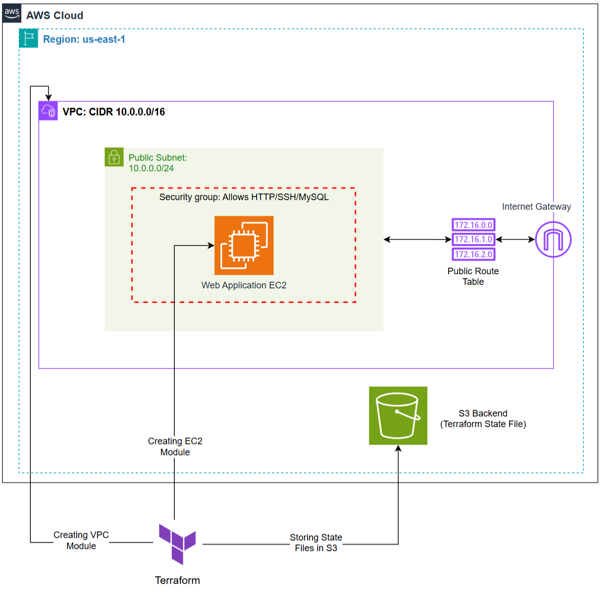

# AWS EC2 WordPress Deployment with Terraform

---

## Project Overview

This project provisions an **AWS EC2 instance** using **Terraform**, installs **WordPress**, and sets up a **MySQL database** on the same instance.  
The deployment is fully automated using a **user data script** that installs and configures Apache, PHP, MySQL, and WordPress.

Terraform modules are used to create:
- A **VPC** with subnets, route tables, internet gateway, and security groups  
- An **EC2 instance** for hosting WordPress  
- An **S3 bucket** for storing the Terraform state file and enabling remote backend locking  

---

## Architecture Overview

<p align="center">
  
</p>

The EC2 instance hosts WordPress, which connects to a local MySQL database configured during boot using a **user data script**.

---

## Project Structure

```plaintext
terraform/
│
├── provider.tf
├── main.tf
├── variables.tf
├── outputs.tf
├── userdata.sh
│
├── modules/
│   ├── vpc/
│   │   ├── main.tf
│   │   ├── variables.tf
│   │   ├── outputs.tf
│   │
│   └── ec2/
│       ├── main.tf
│       ├── variables.tf
│       ├── outputs.tf
│
└── terraform.tfstate (created automatically after apply)
```

---

## Prerequisites

Before running Terraform, ensure the following tools are installed and configured:

1. **Terraform CLI** — [Install Guide](https://developer.hashicorp.com/terraform/install)  
2. **AWS CLI** — [Install Guide](https://docs.aws.amazon.com/cli/latest/userguide/getting-started-install.html)  
3. **AWS Account Credentials** configured via:
   ```bash
   aws configure
   ```
   Enter:
   - AWS Access Key ID  
   - AWS Secret Access Key  
   - Default region (e.g., `us-east-1`)  
   - Output format (e.g., `json`)

---

## Terraform Backend Setup

Create an **S3 bucket** for storing Terraform’s state file and enabling remote state locking:

```hcl
terraform {
  backend "s3" {
    bucket         = "umarsatti-terraform-state-file-s3-bucket"
    key            = "task2/terraform.tfstate"
    region         = "us-east-1"
    encrypt        = true
    use_lockfile   = true
  }
}
```

---

## Deployment Steps

1. **Initialize Terraform**
   ```bash
   terraform init
   ```

2. **Validate Configuration**
   ```bash
   terraform validate
   ```

3. **Preview the Plan**
   ```bash
   terraform plan
   ```

4. **Apply the Infrastructure**
   ```bash
   terraform apply -auto-approve
   ```

5. **Access WordPress**
   - Retrieve the EC2 public IP or DNS from Terraform outputs:
     ```bash
     terraform output
     ```
   - Visit in your browser:
     ```
     http://<public-ip>
     ```

---

## Key Components

| Component | Description |
|------------|-------------|
| **VPC Module** | Provisions VPC, subnet, IGW, route table, and security groups |
| **EC2 Module** | Deploys an EC2 instance with public IP and security group |
| **User Data Script** | Automates Apache, PHP, MySQL, and WordPress installation |
| **S3 Backend** | Stores Terraform state remotely and securely |

---

## Technologies Used

- **Terraform v1.x**
- **AWS (EC2, VPC, S3)**
- **Ubuntu (EC2 AMI)**
- **Apache, PHP, MySQL, WordPress**

---

## References

For detailed setup instructions and module explanations, see the full documentation:  
> *Task 2 Documentation.pdf*

---

## Cleanup

When finished testing or deploying, destroy the created infrastructure to avoid extra AWS costs:

```bash
terraform destroy -auto-approve
```

---

## Outcome

A fully automated WordPress website hosted on AWS EC2 with a MySQL backend, deployed through reusable Terraform modules and remote backend configuration.
